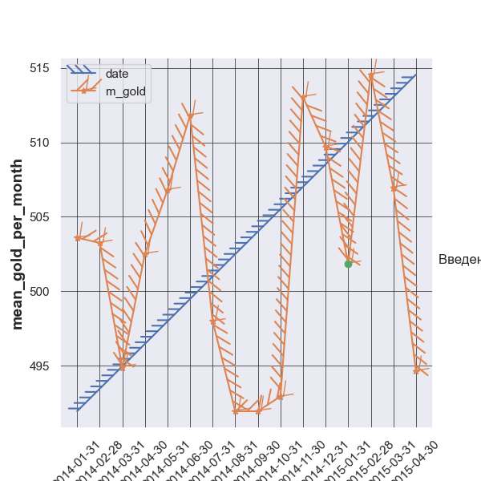
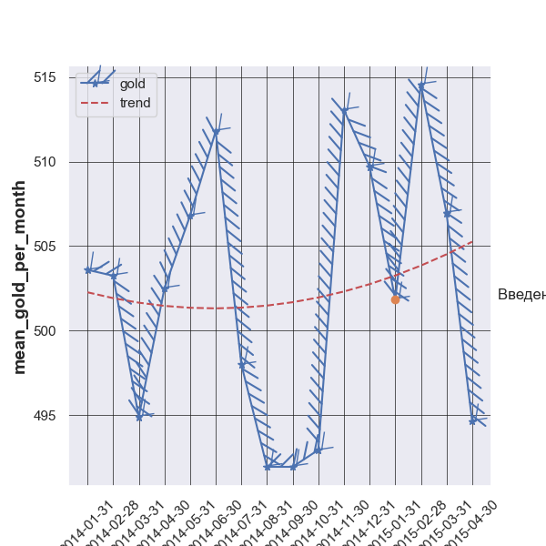
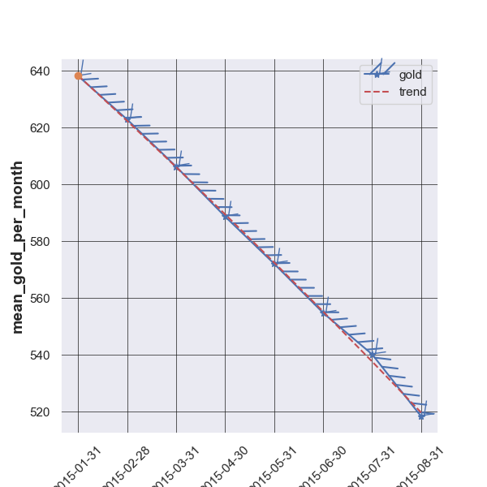

>Main task:

Гномы добывают золото, периодически сообщая о своей добыче.
В этой операции по добыче полезных ископаемых использовались два поколения инструментов,
некоторые гномы были оснащены инструментами 1-го поколения, другие - 2-го поколения.
После внедрения инструментов нового поколения генеральный директор Gnome Inc заметил,
что производительность не соответствует его ожиданиям.
Вы, как аналитик Gnome Inc, должны подтвердить или опровергнуть опасения генерального директора,
подкрепляющие ваши выводы холодными достоверными данными.

Давайте посмотрим, что у нас имеется в датасете при вызове команд:

pd.DataFrame.head() и pd.DataFrame.tail()

Что можно понять по этой части, бегло взглянув на данные?

Для начала посмотрим на названия колонок:

dwarf_id: это непосредственно id каждого гнома, участвующего в тестировании;

hider_date: если дословно, то "дата примема на работу", в контексте нашей задачи это скорее всего дата, когда гном был создан для выполнения свое задачи;

reported_date: требует анализа;

gold_mined: колличество золота, который гном произвел за промежуток времяни;

harmer_date: требует анализа.

Если учесть что количество айдишников дварфов 13493,
а уникальных значений их айди 2677 можно сделать вывод, 
что они повторяются и имеется несколько временных промежутков.

Посмотрим какие есть уникальные значения для дат в датафрейме.

Получается что мы подтверидили нашу догадку,
что hired_date - это дата когда гном был создан.
Промежуток времени когда у гномов были инструменты 1го уровня это от
2014-01-01 до 2015-01-01. После гномам предоставили молот второго уровня.
reported_date - будем считать, днем каждого замера.

        Предложения:
        
Пока основная метрика в теориях это среднее значение, но только на этапе постоения
теорий. Затем метрики могут добавиться и видоизмениться.
 
1) Разделить на 2 датасета. До и после получения нового молота
2) Затем проанализировать то, как шел прирост золота
3) Визуализировать данные по приросту золота в зависимости от даты и молота.

 3.1) Теория 1:
        Новый инструмент не приносит пользу, ровно как и выгоду,
        тогда изменение данных будет стремиться к 0
        при сравнении характеров прироста золота в двух сдучаях.

 3.2) Теория 2:
        Новый инструмент приносит пользу, но не сразу. Тогда
        мы увмидим, что среднее количество заработанного золота у гномов будет
        увеличиваться, только через како-то промежут времени после нововведения,
        а в самом начале не будет никакой разницы или будет средний заработок меньше.
 
 3.3) Теория 3:
        Новый интсрумент приносит пользу сразу.
        Среднее значение растет сразу при получении нового инструмента.

 3.4) Теория 4:
        Новый инструмент приносит убытки. Среднее значения добываемого золота не 
        увеличивается, а уменьшается с момента получения нового молота.

Для получения какого-то результата разделяем на 2 половины наш датасет.
В первой половине все гномы, кто был принят на работу до 2015, во втором осталльные.

Колличество дварфов в 1 датасете: 531

Колличество дварфов во 2 датасете: 2146

Непонятно почему так выходит. Проверяя данные, получаем то, что в датасете количество месяцев наработки неравномерно,
первые гномы работали от 2014-01-01 и до конца. Каждый новый набор гномов работал на 1 месяц больше
чем предыдущие. Получается что, несмотря на то, что строк в двух датасетах одинаково, дварфов больше во втором датасете.
Но они работали меньше чем дварфы из первого.

Для каждого гнома создадим список. Где будут находиться все отсчеты золота, чтобы 
найти определенные метрики. 
Вернемся пока к первоначальному датасету.

Теперь будем считать, что гномы у которых hammer_date = 2014-01-01 - это те гномы которые меняли молот в 2015 г,
а те у кого 2015-01-01 начали работать сразу с новым молотом. Для получения данных проанализируем данный для
тех гномов, которые меняли свои инструменты.

Исходя из этого, получим некоторые данные.

Этот дадасет содержит в себе данные о среднем заработке всех гномов, которые подверглись
выдаче новых молотов в 2015г. По характеру поведения этого среднего, можно попробовать подтвердить или опревергнуть наши догадки.

Из графика видно, что среднее значение с каждым месяцем падает. Что может говорить о том, что 
для добычи ресурсов, введение нового инструмента не сыграло никакой роли, тенденция к уменьшению
дохода с каждого гнома сохранялась и после 2015-01-01.

Взглянем на поведение 2х показателей добычи золота для первых гномов.
Создадим для этого объект мультииндекса по их индивидуальному номеру.

Видно даже не вооруженным глязом, вышеупомянутую тенденцию.

Но если посмотреть на данные опять раздельно. Ведь если у нас почти одинаковое количество строк в 
двух наборах данных, то значит, что и единиц добывающих золото там тоже примерно одинаковое количество.

Взглянем на результат:

Получилось то, что после 2015-01-01 гномы заработали больше.
Это идет в разрез с предыдущими выводами.

Вернемся опять к изначальному способу анализа. Возьмем нашу половину датасета,
где есть гномы, которые начали работать в 2014-01-01 и возьмем тех, кто работал больше всего.

Такие значения мы получили.

График данных: 

Как можно наблюдать из графика для первых гномов, которые успели поработать и в 2014 и в 2015 году,
то характер выроботки у них не столь очевидный как бы нам хотелось. Попробуем определить тренд.

Как видно из линии тренда, вначале производительность падает,
а потом можно заметить что начинает расти, но это может быть ошибочное суждение, 
т.к. мало данных. Но в глобальном смысле, если считать данные достаточными,
то производительность рабочих будет увеличиваться. 
Тогда выходит, что гномы, плолучив новый инструмент, смогли начать зарабатывать больше.

Рассмотрим данные уже на всех рабочих, глобально. И те что были до реновации и, те что после.
Посмотрим как выработка себя ведет.

Теперь график говорит нам опять о том, что гномам введение нового молота не помогло.

Можно посмотреть на данные с другой стороны.
Посмотреть как работают гномы, которые были приняты на работу после 2015-01-01,
когда ожидается, что они уже будет с новым инструментом.
Тогда, если считать, что тем гномам, что приходят на работу после или в
2015-01-01 выдают сразу новый молот.

Выглядит опять так, как будто нововведение никак не помогло. Гномы продолжают не увеличивать
свою производительность.

Попробуем для выдвижения финальных выводов взглянуть на распределение добычи 
в среднем по каждому гному от начала и до конца.

На данном графике можно пронаблюдать увеличение средней добычи каждого гнома, как и на одном из графиков до. 
Когда в определенный момент тенденция к спаду поменялась на подъем. Получается, 
что средняя добыча гномов увеличивается. И если учесть, что последний идентификационый номер гнома, принятого на работу 
в 2014 году находится на 530й позиции, все последующие гномы, которые могли получить и не получить новый молот
продолжают увеличивать свою добычу. Но данный показатель может ввести нас в заблуждение.
Хоть математически - это и есть тренд на добычу золота. То если опять обратиться к тому 
изображения мультииндекса видно, что больше всего золота гномы добывают вначале, когда они были 
только приняты на работу. Данный признак нам не поможет.

Это график распределения добычи золота, который поможет нам сделать последние выводы и подвести итоги.
Если вспомнить значения сумм добычи золота тех, гномов, которые были приняты на работу до 2015-01-01,
то после 2015-01-01 добыча была больше. На графике мы можем видеть такой же результат.

Исходя из всех полученных данных, можно сделать следующие выводы:
1) Гномы уменьшают уровень добычи с течением времени.
2) Гномы на старте зарабатывают больше.
3) Гномы получившие новый молот имеют тенденцию к чуть меньшему падению производительности.
4) Гномы получившие сразу новый инструмент на старте зарабатывают больше.

# Если учесть, что предположения верны. И 2015-01-01 - это точка "Реновации",то получаем следующий итог:

> Лучше всего - вручение новой модели молота, новопришедшему на работу гному. Так как 
> на старте такие гномы зарабатывают гораздо больше золота. Но для того, что избежать
> дальнейшего падения производительности гномов с течением времени следует заключать с ними контракты
> на фиксированное короткое время, когда у гномов наблюдается максимальная производительность.
> Тогда можно добиться большей экономической выгоды и окупить затраты на приобретение 
> новых инструментов (процесс вычисления можно пронаблюдать в - "notebooks/updating_test (2).ipynb"

#
Также хочу оставить отзыв о датасете: 

При рассмотрении данных не очень хорошо видно, когда гномы получили новый инструмент.
А ведь это принципиальный вопрос, от которого буду идти все дальнейшие рассуждения.
В наборе данных есть 3 столбца с датами. 2 из этих столбцов можно определить однозначно,
даже исходя из перевода. Третий же не столь однозначный. В задаче говорится, что
имеется точка, когда гномы получают новый инструмент, но не говорят какая.
Из всех величин, которые нам могут на это намекать есть только третий неопознанный 
столбец с датами, в котором есть только 2 даты: 2014-01-01 и 2015-01-01.
Можно делать бесконечно большое количество суждений, например,
1) Гномы получили новый молот в 2014, но частично, а в 2015 полностью,
2) Гномы получили новый молот в 2015-01-01, причем заместили старый полностью, а те, кто приходили на работу после 2015-01-01 получали новый молот сразу,
3) Гномы получили новый молот в 2015-01-01, причем заместили старый полностью, а те, кто приходили на работу после 2015-01-01 получали новый молот не сразу,
и пр.

Для того чтобы получить однозначный результат, не хватало только понимания точки, 
откуда стоить считать точку замены молота первого поколения на второго и в том случае
если замещение моделей было не полностью, то какой процент гномов получил новый молот, 
либо метка о получении нового инструмента. Тогда в моем понимании данные были ли бы исчерпывающими.

